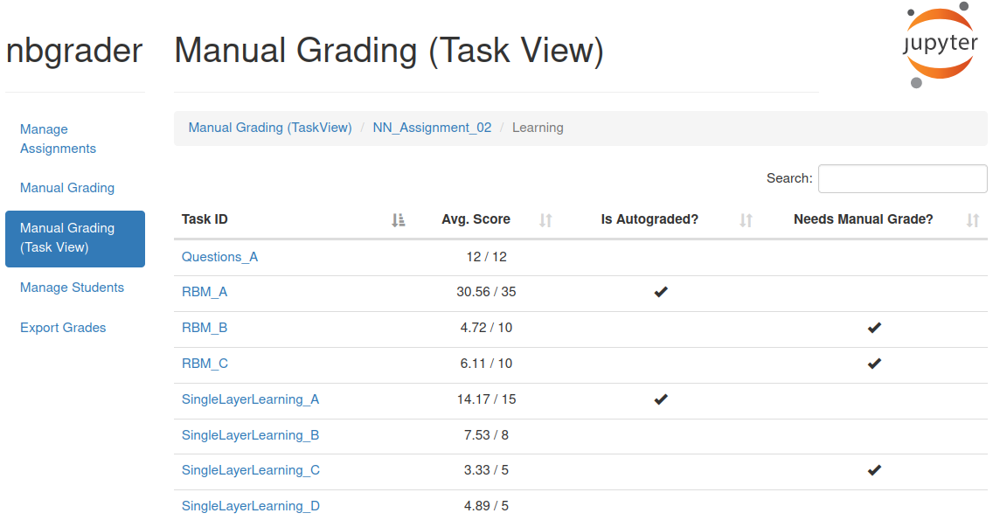

# e2xgrader

[](https://pypi.org/project/e2xgrader)
[](https://opensource.org/licenses/MIT)
[](https://sonarcloud.io/summary/new_code?id=DigiKlausur_e2xgrader)
[](https://e2xgrader.readthedocs.io)
[](https://github.com/astral-sh/ruff)
[](https://github.com/psf/black)

e2xgrader is an add-on for nbgrader that adds functionality for teachers and students.
e2xgrader introduces new cell types and tools for graders (per question grading view, authoring component, pen-based grading) and students (assignment toolbar, exam toolbar, restricted notebook extension).
Please refer to the [documentation](https://e2xgrader.readthedocs.io) for further information.

_Currently e2xgrader works with notebook<7 or nbclassic. We are working on porting the notebook extension to lab extensions_

## Screenshots

A multiple choice cell:

<br/>

An annotated student answer:

<br/>

A per question grading view for teachers:

<br/>

A help extension to make docs and other files available to students:

<br/>

An assignment toolbar for students:

<br/>

An exam toolbar for students:

<br/>

## JupyterCon 2023 Talk

[](https://www.youtube.com/watch?v=fc3Tvr_jm3w "e2xgrader: An Add on for Improved Grading and Teaching with Jupyter Notebooks at Scale | JupyterCon 2023")

## Install

To install e2xgrader, execute:

```bash
pip install e2xgrader
```

## Change Mode

e2xgrader comes in three different modes, `teacher`, `student` and `student_exam`.
You can switch between them:

```bash
e2xgrader activate teacher --sys-prefix
e2xgrader activate student --sys-prefix
e2xgrader activate student_exam --sys-prefix
```

## Uninstall

To uninstall, execute:

```bash
e2xgrader deactivate --sys-prefix
pip uninstall e2xgrader
```
