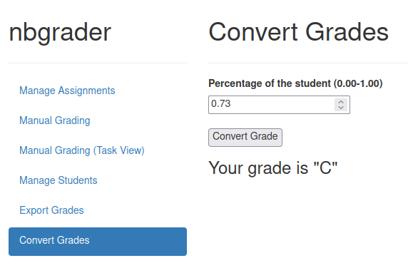

======================
Adding Custom Web Apps
======================

To extend **e2xgrader** you can add custom server apps to it.
A custom server app can add templates, handlers and change the tornado settings of the jupyter server.

Different apps are activated in different modes. You can configure which apps should be activated in each mode via the `TeacherExtension`, `StudentExtension` and `StudentExamExtension` traits.

Creating a Simple App
---------------------

To create an app, you need to install `e2xcore` and extend the `BaseApp` class.
As an example we will build a simple app that converts student score into letter grades.

The layout of the app is:

.. code-block:: sh
    :caption: Layout of the app

    grade_converter
    ├── pyproject.toml
    ├── README.md
    └── grade_converter
        ├── app.py
        ├── handlers.py
        └── templates
            ├── base.tpl
            └── convert_grades.tpl

The Basic App
~~~~~~~~~~~~~

The app will display a page where you can convert a grade and respond with the letter grade.
Let's start by looking at the file `app.py`.

.. code-block:: python
    :caption: app.py

    # File app.py
    import os

    from e2xcore import BaseApp, urljoin
    from nbgrader.apps.baseapp import NbGrader

    from traitlets import Dict, Unicode, Float
    from traitlets.config import LoggingConfigurable

    from .handlers import default_handlers

    class GradeConverter(NbGrader, BaseApp):
        grading_scheme = Dict(
            key_trait=Unicode(),
            value_trait=Float(),
            default_value={
                "A+": 0.97,
                "A": 0.93,
                "A-": 0.9,
                "B+": 0.87,
                "B": 0.83,
                "B-": 0.8,
                "C+": 0.77,
                "C": 0.73,
                "C-": 0.7,
                "D+": 0.67,
                "D": 0.65,
                "F": 0.0,
            },
        ).tag(config=True)

        def __init__(self, **kwargs):
            NbGrader.__init__(self, **kwargs)
            BaseApp.__init__(self, **kwargs)

        template_path = os.path.join(os.path.dirname(__file__), "templates")

        def load_app(self):
            self.log.info("Loading the convert grades app")
            self.initialize([])
            # Add the grading scheme to the tornado settings
            self.update_tornado_settings(dict(e2x_grading_scheme=self.grading_scheme))
            self.add_handlers(default_handlers)
            self.add_template_path(self.template_path)

The grading scheme can be configured via the `grading_scheme` trait. **e2xgrader** will call the `load_app` method when loading the app. 
Here we first start by putting the grading scheme in the tornado settings, making it accessible anywhere.
Then we add the handlers defined in `handlers.py`. Finally we add the templates.

The Handlers
~~~~~~~~~~~~

Let's define the handlers next. The file `handlers.py` looks like this:

.. code-block:: python
    :caption: handlers.py

    # File handlers.py
    import json

    from e2xcore import urljoin
    from e2xcore.handlers import E2xApiHandler

    from tornado import web
    from nbgrader.server_extensions.formgrader.base import check_xsrf, BaseHandler

    # Helper function to convert the percentage to a grade given a grading scheme
    def convert_percentage_to_grade(percentage, grading_scheme):
        grade = ""
        for letter_grade, percent in sorted(grading_scheme.items(), key=lambda x: x[1]):
            if percentage < percent:
                break
            grade = letter_grade
        return grade

    # Handler to convert percentage to letter grade
    class ConvertGradeApiHandler(E2xApiHandler):
        def initialize(self):
            self.grading_scheme = self.settings["e2x_grading_scheme"]

        @web.authenticated
        def get(self):
            # Get the percentage argument and convert it to float
            percentage = float(self.get_argument("percentage"))
            # Respond with the converted grade
            self.finish(
                json.dumps(convert_percentage_to_grade(percentage, self.grading_scheme))
            )

    # Handler to display the template defined in convert_grades.tpl
    class ConvertGradeHandler(BaseHandler):
        @web.authenticated
        @check_xsrf
        def get(self):
            # Render the template, make sure to provide the base url here
            html = self.render("convert_grades.tpl", base_url=self.base_url)
            self.finish(html)

    # Urls under which the handlers are exposed
    default_handlers = [
        (urljoin("e2x", "convert", "api"), ConvertGradeApiHandler),
        (urljoin("e2x", "convert", "app"), ConvertGradeHandler),
    ]

Template
~~~~~~~~

If we want to create a link in the nbgrader formgrader sidebar, we have to change the base template ``base.tpl``.
This template is located at ``e2xgrader/e2xgrader/server_extensions/apps/formgrader/templates/base.tpl``.

We copy the template and change the lines concerning the sidebar:

.. code-block:: jinja
    :caption: base.tpl

    ...

    
      <li role="presentation" id="manage_assignments"><a href="{{ base_url }}/formgrader/manage_assignments">Manage Assignments</a></li>
      <li role="presentation" id="gradebook"><a href="{{ base_url }}/formgrader/gradebook">Manual Grading</a></li>
      <li role="presentation" id="gradebook_questions"><a href="{{ base_url }}/formgrader/gradebook?view=task">Manual Grading (Task View)</a></li>
      <li role="presentation" id="manage_students"><a href="{{ base_url }}/formgrader/manage_students">Manage Students</a></li>
      <li role="presentation" id="export_grades"><a href="{{ base_url }}/formgrader/export_grades">Export Grades</a></li>
      <li role="presentation" id="convert_grades"><a href="{{ base_url }}/e2x/convert/app">Convert Grades</a></li>
    

    ...

Next we define a very simple template in which we can move a slider to select the percentage and convert it with a click of a button.

.. code-block:: jinja
    :caption: convert_grades.tpl

    

    
    Convert Grades
    

    
    {{ super() }}
    
    

    

    <form method="get" id="gradeForm" action="{{ base_url }}/e2x/convert/api"/>
      <fieldset>
        

          <label for="percentage">Percentage of the student (0.00-1.00)</label> 
          <input type="number" name="percentage" id="percentage" min="0" max="1" step="0.01" />      
        

         
        <input type="submit" value="Convert Grade">
      </fieldset>
    </form>
    

    <h3 id="grade"></h3>
    

    
    

Make the App Installable
~~~~~~~~~~~~~~~~~~~~~~~~

Finally we need to add a `pyproject.toml` to make the app installable.

.. code-block:: toml
    :caption: pyproject.toml

    [build-system]
    requires = ["hatchling"]
    build-backend = "hatchling.build"

    [project]
    name = "grade_converter"
    description = "An addon for e2xgrader that converts grades"
    readme = "README.md"
    requires-python = ">=3.8"
    license = "MIT"
    version = "0.0.1"
    authors = [
    { name = "Tim Metzler", email = "tim.metzler@h-brs.de" },
    ]
    dependencies = [
        "e2xcore",
    ]

    [tool.hatch.build.targets.wheel]
    artifacts = ["grade_converter/templates"]

Activating the App
~~~~~~~~~~~~~~~~~~

Once you are done, install your app locally by navigating to the directory with the `pyproject.toml`.
Execute the following

.. code-block:: bash

    pip install .

Now we need to activate the app in the `nbgrader_config.py`. We decide the app should be active in teacher mode.

.. code-block:: python
    :caption: nbgrader_config.py

    # nbgrader_config.py

    from e2xgrader.config import configure_base
    from grade_converter.app import GradeConverter

    c = get_config()
    configure_base(c)

    # Add the app in teacher mode
    # We need to add it as the first app since we want to overwrite base.tpl
    # If you give multiple directories with templates with the same name to jinja,
    # the first one will take precedence.
    c.TeacherExtension.apps.insert(0, GradeConverter)

You can try it out by starting the Jupyter notebook server and opening the formgrader tab. Then click on the "Convert Grades" link in the sidebar.

    The GradeConverter app in action

Configuring the App
~~~~~~~~~~~~~~~~~~~

We can now easily change the grading scheme via the ``nbgrader_config.py``.

.. code-block:: python
    :caption: nbgrader_config.py

    # nbgrader_config.py

    from e2xgrader.config import configure_base
    from grade_converter.app import GradeConverter

    c = get_config()
    configure_base(c)

    # Configure the grading scheme
    c.GradeConverter.grading_scheme = {
      "great": 0.9,
      "good": 0.8,
      "okay": 0.7,
      "average": 0.6,
      "fail": 0.0
    }

    # ...
