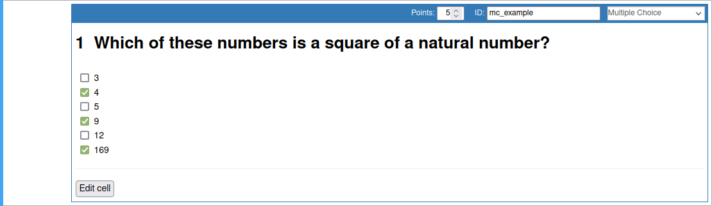
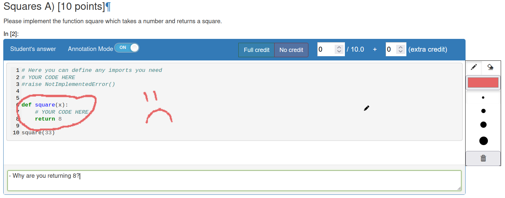
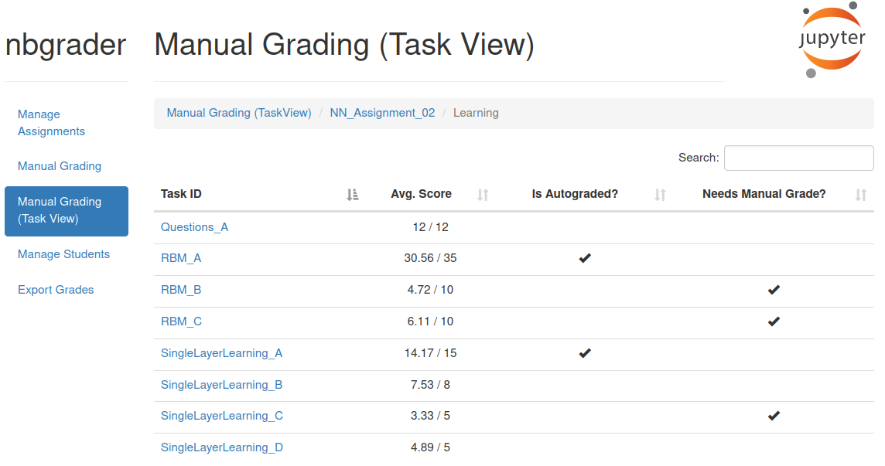
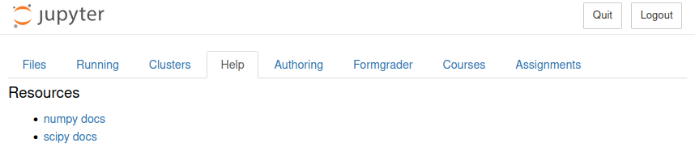
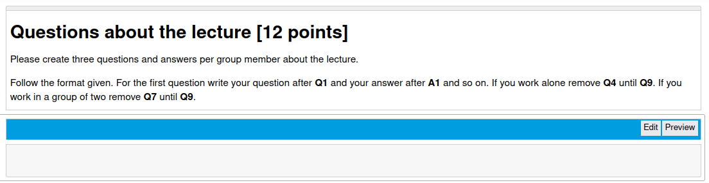
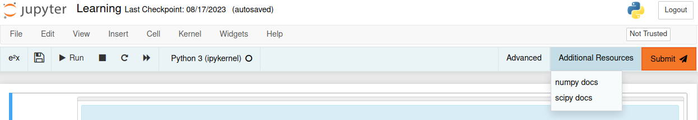

.. e2xgrader documentation master file, created by
   sphinx-quickstart on Fri May 19 17:08:57 2023.
   You can adapt this file completely to your liking, but it should at least
   contain the root `toctree` directive.

#######################
e2xgrader Documentation
#######################

Welcome to the **e2xgrader** documentation. **e2xgrader** is an add-on for nbgrader that adds functionality for teachers and students.

* **Expanded Functionality:** Enhance nbgrader with new features, catering to teachers, students, and exams.
* **Efficient Authoring:** Simplify content creation using the `e2xauthoring <http://e2xauthoring.readthedocs.io>`_ component, aiding teachers in designing assessments.
* **Varied Question Types:** Introduce custom cells like multiple choice, single choice, diagram, and upload for comprehensive evaluation.
* **Focused Grading:** Assess responses per question using the task view for easier navigation.
* **Interactive Annotation:** Provide clear feedback through pen-like annotations on student answers.
* **Easy Grade Export:** Export grades seamlessly for efficient record-keeping and analysis.
* **Student-Friendly Tools:** Empower students with intuitive toolbars, improving their assessment experience.
* **Custom Exchange:** Customize the exchange to use dedicated directories for each student, allowing custom assignments per student
* **Supportive Help App:** Distribute essential documents and files using the integrated help app for a well-guided assessment process.

Screenshots
===========

To get a better idea of e2xgrader, here are some screenshots.

    A custom multiple choice cell.

    An annotated student answer

    Task view showing all questions in a notebook

    Help extension displaying documentation

    Assignment cell toolbar

    Exam toolbar

Getting Started
===============
.. toctree::
   :maxdepth: 2

   getting_started/index

User Documentation
==================

.. toctree::
   :maxdepth: 2

   user_docs/index

Develop Extensions
==================

.. toctree::
   :maxdepth: 2

   extensions/index

Indices and tables
==================

* :ref:`genindex`
* :ref:`modindex`
* :ref:`search`
