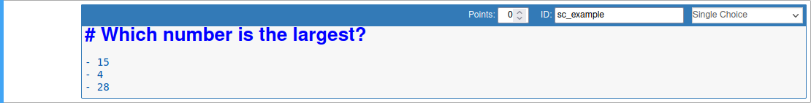
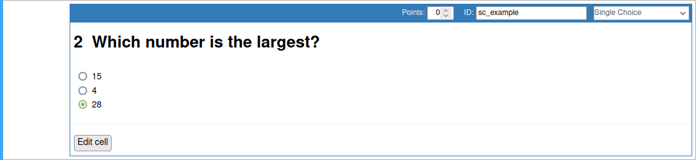
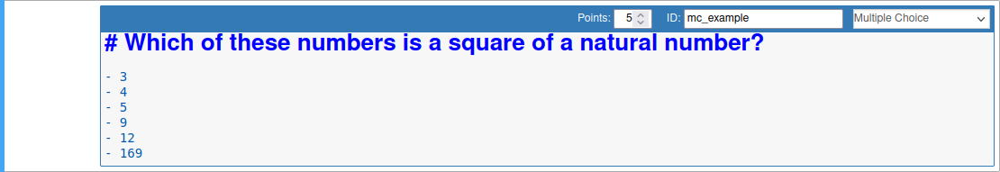
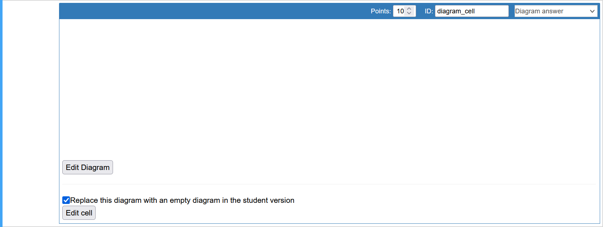
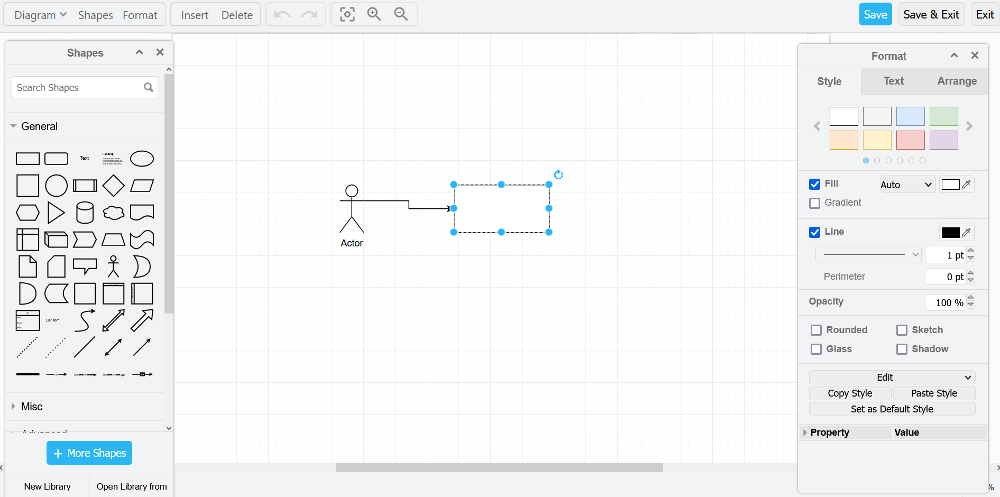
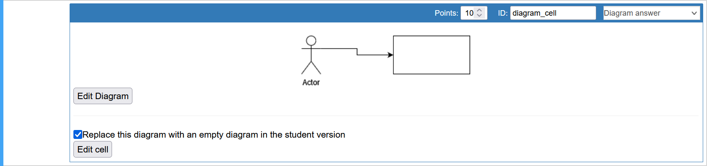
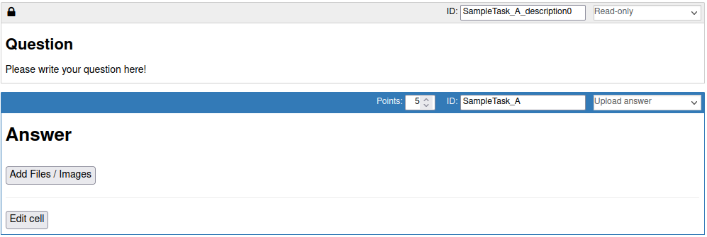
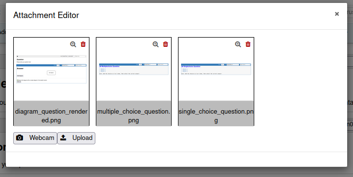

============
Custom Cells
============

**e2xgrader** comes with custom cells for students and teachers.

Choice Cells
------------

**e2xgrader** comes with built-in support for multiple and single choice cells.

Single Choice Cells
~~~~~~~~~~~~~~~~~~~

A single choice cell is an extended markdown cell that turns lists into radio buttons. 
To create a single choice cell, activate the `Create Assignment` toolbar and change the desired cell to `markdown`.
Then select the option `Single Choice` from the dropdown menu.
Make sure to select the correct choices in your source version.

Here is an example of an unrendered single choice cell:

    A singlechoice cell in edit mode

The rendered cell looks like this:

    A rendered singlechoice cell with a choice selected

In student mode the `Edit Cell` button is deactivated and students can not unrender the cell.
During grading the student will only receive full points if the correct answer is selected.

Multiple Choice Cells
~~~~~~~~~~~~~~~~~~~~~

A multiple choice cell is an extended markdown cell that turns lists into checkboxes. 
To create a multiple choice cell, activate the `Create Assignment` toolbar and change the desired cell to `markdown`.
Then select the option `Multiple Choice` from the dropdown menu.
Make sure to select the correct choices in your source version.

Here is an example of an unrendered multiple choice cell:

    A multiplechoice cell in edit mode

The rendered cell looks like this:

.. figure:: img/mc_render.png
    :alt: A rendered multiplechoice cell

    A rendered multiplechoice cell with some choices selected

In student mode the `Edit Cell` button is deactivated and students can not unrender the cell.
During grading a student will receive points for every selected choice that is correct and every not selected choice that is incorrect.
The student will lose points for every correct answer that is not selected and every incorrect answer that is selected.
If you want to change the grading scheme take a look at the :ref:`custom autograders section <custom_autograders>`.

Diagram Cells
-------------

`e2xgrader` comes with built-in support for diagram cells. The diagram editor used is from `diagrams.net`_ (formerly draw.io).

A diagram cell is an extended markdown cell with an image attachment that can be opened in a diagram editor. 

To create a diagram cell, activate the `Create Assignment` toolbar and change the desired cell to `markdown`.
Then select the option `Diagram Cell` from the dropdown menu.

    A diagram cell with an empty diagram

When you click on the `Edit Diagram` button, the diagram editor is shown in the same window:

    The diagram editor

All changes made here are saved and displayed back in the cell:

    A diagram cell with a diagram

When creating a diagram cell you can choose if the student should be given a partially filled diagram or if they always start from an empty diagram.
By clicking on the `Edit Cell` button, you can add markdown to the diagram cell (i.e. a heading).
In student mode the `Edit Cell` button is deactivated and students can not unrender the cell.

.. _diagrams.net: https://diagrams.net

Configuring the Diagram Cells
~~~~~~~~~~~~~~~~~~~~~~~~~~~~~

You can configure the following options for the diagram cells in your ``nbgrader_config.py``:

* ``drawDomain``: The domain of the diagram instance to use
* ``drawOrigin``: The url of the origin of the diagram instance. This is the url from which the diagram instance sends messages
* ``libraries``: A list of libraries which should be active by default (e.g. *uml*, *general*, *kubernetes*, etc)

.. code-block:: python
    :caption: Example of configuring the diagram editor

    # nbgrader_config.py

    c.DiagramEditor.drawDomain = "https://embed.diagrams.net/"
    c.DiagramEditor.drawOrigin = "https://embed.diagrams.net/"
    c.DiagramEditor.libraries = ["uml", "general", "arrows2"]

Upload Cells
------------

Upload cells are cells where students can upload files and take images via the webcam. These files are stored within the notebook.

    An upload cell

Students can upload files and take images via the webcam by clicking on the *Add Files / Images* button.
This opens the attachment editor.

    The attachment editor

*Note: The webcam upload has not been tested across all browsers and devices and will likely not work on mobile.*