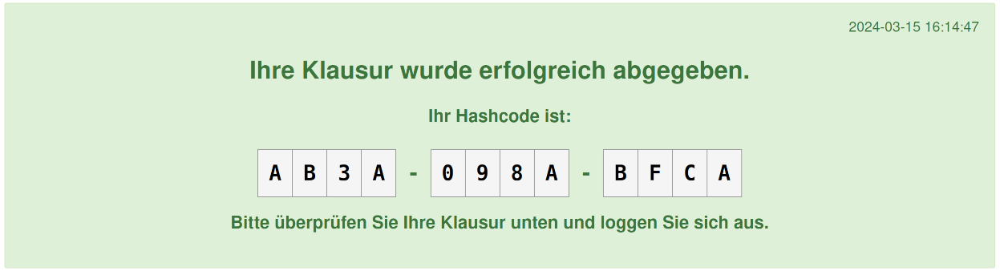

.. _custom_submit_exchange:

======================
Custom Submit Exchange
======================

The custom exchange also comes with a custom submit. This exchange behaves differently
based on the active `e2xgrader` mode.

Assignment Mode
---------------

In `student` mode, the submit exchange will only copy over all files to the exchange directory.

Exam Mode
---------

In `student_exam` mode, the submit exchange will hash all files in the assignment directory and store the hashes in a file.
The default hashing method is sha1. The file containing the hashes is called `SHA1SUM.txt`.
The contents of the file can be checked in the terminal with the command:

.. code-block:: bash

   sha1sum -c SHA1SUM.txt

Additionally, the exchange will convert all notebooks to html files for students to check their submission.
The name of the html file is the same as the notebook file with the extension `_hashcode.html`.

A cell is added to the top of the html file with the hashcode and timestamp of the notebook.
The hashcode displayed is truncated to 12 characters.

.. figure:: img/submitted_html.png
   :align: center

   Example of the html file generated by the exam exchange.

The message displayed in the cell is customizable. As an example, here is the configuration for a custom message:

.. code-block:: python

   # nbgrader_config.py

   from e2xgrader.config import configure_base, configure_exchange

   c = get_config()

   # Register custom preprocessors for autograding and generating assignments
   configure_base(c)

   # Register custom exchange
   configure_exchange(c)

   c.SubmissionExporter.exam_submitted_message = "Ihre Klausur wurde erfolgreich abgegeben."
   c.SubmissionExporter.your_hashcode_message = "Ihr Hashcode ist:"
   c.SubmissionExporter.verify_exam_message = "Bitte überprüfen Sie Ihre Klausur unten und loggen Sie sich aus."

The resulting html file will look like this:

   Example of the html file generated by the exam exchange with a custom message.

Advanced Exam Configuration
~~~~~~~~~~~~~~~~~~~~~~~~~~~

The submit exchange can also be configured to use different `HTMLExporter`.
It is advised to use an exporter that inherits from `e2xgrader.exporters.E2xExporter`, since it makes sure all custom cells are rendered correctly.

This is done via:

.. code-block:: python

   # nbgrader_config.py

   from e2xgrader.config import configure_base, configure_exchange

   c = get_config()

   # Register custom preprocessors for autograding and generating assignments
   configure_base(c)

   # Register custom exchange
   configure_exchange(c)

   # Use a custom HTMLExporter
   c.ExchangeSubmit.submission_exporter_class = "e2xgrader.exporters.SubmissionExporter"

The exporter will be initialized with the `nbgrader_config`` and called with the `hashcode` and `timestamp` as resources:

.. code-block:: python

   exporter = self.submission_exporter_class(config=self.config)
   exporter.from_notebook_node(nb, resources=dict(hashcode=hashcode, timestamp=timestamp))