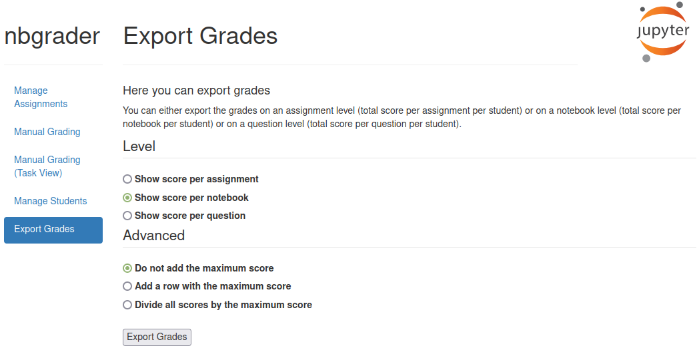
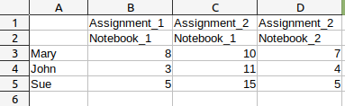
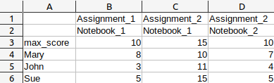
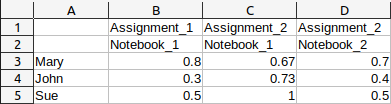

========================
Exporting Student Grades
========================

After grading students, teachers often want to export the grades / score from nbgrader.

    Exporting student grades

To generate a `csv` file of all grades you can use the *Export Grades* features.

Options
-------

Depending on how granular the information you want to export should be, you choose three levels of export:

* *Show score per assignment:* This sums up all scores per student for each notebook in an assignment
* *Show score per notebook:* This gives you individual scores per student per notebook in an assignment
* *Show score per question:* This gives you individual scores for each question the student answered

You have three options on how to display the score per student:

* *Do not add the maximum score:* Only the score per student is exported.
* *Add a row with the maximum score:* A new row with the maximum attainable score per assignment / notebook / question is added.
* *Divide all scores by the maximum score:* Normalize the scores to lie in the range 0-1, where 1 is 100% of the score.

    This is the result of the grade export on notebook level. There are three students (Mary, John and Sue) and two assignments (Assignment_1 and Assignment_2).
    The second assignment contains two notebooks.

    This is the result of the grade export on notebook level. There are three students (Mary, John and Sue) and two assignments (Assignment_1 and Assignment_2).
    There is one row showing the maximum score for each notebook.

    This is the result of the grade export on notebook level with the option *Divide all scores by the maximum score* checked. Notice how each score is normalized.