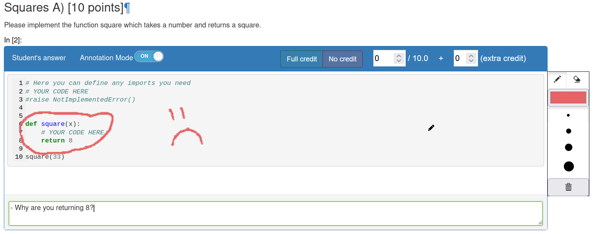

================
Grading Features
================

Task View
---------

When grading with nbgrader you will always see the whole notebook for each student.
Often times grading is split between different graders, where each grader only looks at one question.
For this there is the *task view*, which the scores and submissions for a single question.

.. figure:: img/task_view.png
    :alt: The task view 

    The task view for the assignment NN_Assignment_02/Learning. All questions are shown.

When selecting a question, you will see all submissions for that particular question.

    The task view for the question SingleLayerLearning_B from the assignment NN_Assignment_02/Learning.

When selecting a submission only cells with the solution id as part of their id will be shown.
To make sure all relevant cells are shown for a question it is recommend to create questions via **e2xauthoring**.
If you create them yourself, make sure all cells relevant to the question include the solution cell id.
If your solution cell id is *question1*, the read-only cell could be named *question1_description* and the test cells should be called *test_question1_0*, *test_question1_1*, and so on.

Annotating Student Answers
--------------------------

e2xgrader lets you annotate student answer by drawing on them.

    A student answer, annotated by a grader

These annotations will show up in the generated feedback.