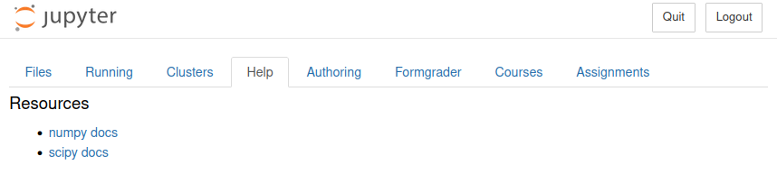

.. _help_extension:

==============
Help Extension
==============

**e2xgrader** ships with an extension to provide students and teachers with documentation and help files.
This can be used to provide students with cheat sheets or any other additional resources.

The help app displays a tab in the tree view:

    The help tab, configured to show the numpy and scipy documentation

Configuration
-------------

To configure the help extension, use the `shared_paths` trait:

.. code-block:: python

   # nbgrader_config.py

   ...
   # Assume there are two directories "numpy docs" and "scipy docs" in "/home/user/docs/".
   # Both the "numpy docs" and "scipy docs" directory contain an index.html file
   c.Help.shared_paths = ["/home/user/docs/"]

The help tab will render an entry for each file or directory in the each of the shared paths.
If the shared path contains a directory with an `index.html`, the help tab will render an entry with the name of the directory.
If there is no `index.html`, all files in the directory will be rendered as a separate entry.

When clicking on an entry, the file will be opened in a new tab / window.