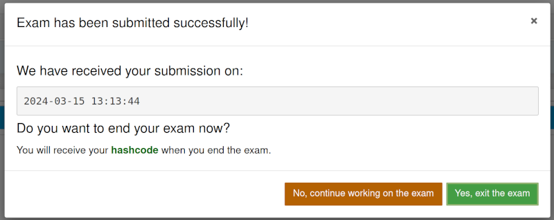
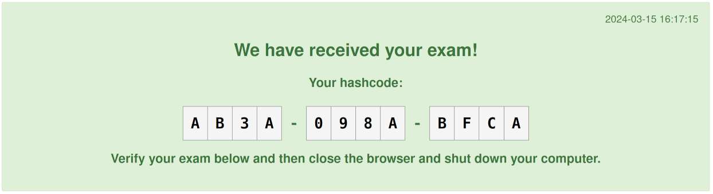

===============
e2xgrader Modes
===============

**e2xgrader** comes with three different modes, each enabling different server and notebook extensions.
To switch between modes, head over to the :ref:`activate a mode <e2xgrader_modes>` section.

Teacher Mode
------------

The following extensions are activated in teacher mode:

* Custom formgrader interface
* Authoring component
* Custom cells
* Help Extension

Student Mode
------------

The following extensions are activated in student mode:

* Custom cells
* Help Extension
* A toolbar for students that highlights cells that should contain the student answer
* A notebook extension that permits students from changing any nbgrader cells or pasting nbgrader cells

    A message that appears when a student tries to change the type of an nbgrader cell

    A message that appears when a student tries to move an nbgrader cell

.. figure:: img/assignment_toolbar_md.png
    :alt: Assignment toolbar for markdown cells

    Assignment toolbar for a markdown solution cell. Students can switch between rendered and edit mode.

    Assignment toolbar for a code solution cell. Students can execute the cell.

Student Exam Mode
-----------------

All extensions from student mode are activated in student exam mode, alongside the following extensions:

* A notebook extensions that permits students from creating or deleting files.
* An exam toolbar which includes the entries from the help app and a submit button from within the notebook
* Shortcuts that add new cells when executing the last cell of the notebook are disabled

Exam Toolbar
~~~~~~~~~~~~

The exam toolbar is displayed in student exam mode. It contains all the resources from the :ref:`help extension <help_extension>`.

.. figure:: img/exam_toolbar.png
    :alt: Exam toolbar

    Exam toolbar, displaying the content of the help tab under *Additional Resources*.

The exam toolbar contains a submit button, where students can submit from within the notebook.
It autosaves the notebook and submits the assignment. If used with the :ref:`custom exchange <custom_exchange>`, the timestamp of the submission is displayed.
Additionally, all files in the notebook directory are hashed and the hashes are stored in a file called `SHA1SUM.txt` in the same directory as the notebook.
The point of the hashcode is to create a checksum over an exam such that students can always check the integrity of their exam.
Then all notebooks are converted to html files for students to check their submission.
The name of each html file is the same as the notebook file with the extension `_hashcode.html`.

    Dialog displayed after submit is clicked.

Students have the option to continue working on the notebook after submitting or exiting the exam.
When the exam is exited, the student is redirected to the html version of the current notebook.

Here they can check the integrity of their submission.

A cell is added to the top of the html file with the hashcode and timestamp of the notebook.
The hashcode displayed is truncated to 12 characters.

More information about the custom submit exchange can be found in the :ref:`custom submit <custom_submit_exchange>` section.

   Example of the html file generated by the exam exchange.