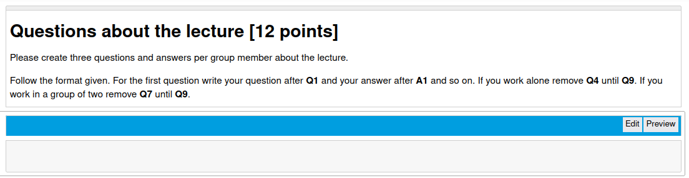

===============
e2xgrader Modes
===============

**e2xgrader** comes with three different modes, each enabling different server and notebook extensions.
To switch between modes, head over to the :ref:`activate a mode <e2xgrader_modes>` section.

Teacher Mode
------------

The following extensions are activated in teacher mode:

* Custom formgrader interface
* Authoring component
* Custom cells
* Help Extension

Student Mode
------------

The following extensions are activated in student mode:

* Custom cells
* Help Extension
* A toolbar for students that highlights cells that should contain the student answer
* A notebook extension that permits students from changing any nbgrader cells or pasting nbgrader cells

.. figure:: img/cell_type_change_alert.png
    :alt: Cell type change alert

    A message that appears when a student tries to change the type of an nbgrader cell

.. figure:: img/move_cell_alert.png
    :alt: Move cell alert

    A message that appears when a student tries to move an nbgrader cell

    Assignment toolbar for a markdown solution cell. Students can switch between rendered and edit mode.

.. figure:: img/assignment_toolbar_code.png
    :alt: Assignment toolbar for code cells

    Assignment toolbar for a code solution cell. Students can execute the cell.

Student Exam Mode
-----------------

All extensions from student mode are activated in student exam mode, alongside the following extensions:

* A notebook extensions that permits students from creating or deleting files.
* An exam toolbar which includes the entries from the help app and a submit button from within the notebook
* Shortcuts that add new cells when executing the last cell of the notebook are disabled

Exam Toolbar
~~~~~~~~~~~~

The exam toolbar is displayed in student exam mode. It contains all the resources from the :ref:`help extension <help_extension>`.

.. figure:: img/exam_toolbar.png
    :alt: Exam toolbar

    Exam toolbar, displaying the content of the help tab under *Additional Resources*.

The exam toolbar contains a submit button, where students can submit from within the notebook.
It autosaves the notebook and submits the assignment. If used with the :ref:`custom exchange <custom_exchange>`, the timestamp of the submission is displayed.
If the assignment only contains a single notebook with the same name as the assignment, a hashcode will be generated.
The point of the hashcode is to create a checksum over an exam s.t. students can always check the integrity of their exam.

.. figure:: img/submit.png
    :alt: Submit confirmation

    Dialog displayed after submit is clicked.

There is also a link where students can verify their submission. When they click on it, they will see an HTML version of their submitted exam. This way students can make sure all their answers are in the submitted version.
The HTML version also contains the hashcode and timestamp.